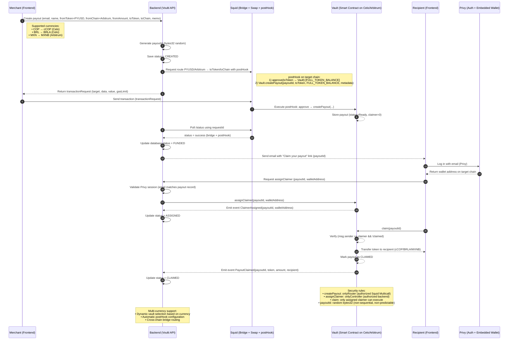

# 💸 Voulti Instant Payouts

### Global payouts in PYUSD, settled instantly in local stablecoins.

---

## 🌍 Overview

**Voulti Payouts** is a multi-chain payout dashboard that allows global merchants to send payments in **PYUSD** and automatically distribute local stablecoins — such as **cCOP (Colombia)**, **BRL1 (Brazil)**, and **MXNB (Mexico)** — to their recipients.

The project was built for **ETHOnline 2025**, as part of the **PayPal USD track**, with the goal of demonstrating how **PYUSD** can become a real settlement rail for cross-border payments in emerging markets.

---

## 🧠 Problem

Today, millions of freelancers, creators, and service providers in Latin America receive international payments through platforms like PayPal, but:

- Transfers are **slow** and **expensive**.
- Converting USD to local currency often means **losing up to 10% in fees**.
- Access to banking or PayPal withdrawals is limited in many regions.

PYUSD solves the digital dollar part — but not the **last mile** of local liquidity.

---

## 💡 Solution

**Voulti Payouts** bridges that gap by enabling **both single and bulk payouts**.

Merchants or platforms can:

1. Fund their account in **PYUSD**.
2. Choose between:
   - 💸 **Single payout** – send one payment directly to a recipient in their local stablecoin.
   - 📦 **Bulk payouts** – upload a list of multiple recipients with payout amounts and countries.
3. Run the payment(s), and Voulti automatically handles the routing, conversion, and delivery of funds in the **correct local stablecoin** and **network**.

For example:

- 🇲🇽 Mexico → **MXNB** on Arbitrum
- 🇨🇴 Colombia → **cCOP** on Celo
- 🇧🇷 Brazil → **BRLA** on Celo

The result: fast, transparent, and affordable payouts that feel native to each market — whether it's one payment or hundreds.

## 🔄 System Flow



---

## ⚙️ MVP Scope

The MVP focuses on two simple flows:

- **Single Payout:** A merchant sends one payment in PYUSD, and the recipient instantly receives the equivalent in their local stablecoin.
- **Bulk Payouts:** The merchant executes **multiple payouts in one click**, distributing PYUSD into cCOP, BRLA, and MXNB across different networks.

Both flows are tracked through a dashboard that displays:

- Current **PYUSD balance**
- **Total paid** in USD
- **Number of payouts executed**
- **Countries reached**
- Average **settlement time**

## 🏗️ Architecture

The system consists of two main components:

- **Frontend (Next.js)**: Merchant dashboard and recipient portal with Privy authentication
- **Smart Contracts (Solidity)**: PayoutVault contracts deployed on Celo and Arbitrum for secure token management

### Supported Networks & Tokens

- **Arbitrum One**: PYUSD (merchant funding), MXNB (Mexican peso)
- **Celo**: cCOP (Colombian peso), BRLA (Brazilian real)

---

## 🚀 Vision

Our mission is to make **global payouts truly borderless** — where digital dollars like PYUSD flow seamlessly into local stablecoins across emerging economies.

In the long term, **Voulti Payouts** aims to serve as the foundation for:

- Real-time cross-border payrolls
- Creator economy payments
- On-chain settlement for marketplaces and platforms

---

## 🛠️ Development Setup

### Prerequisites

- Node.js v20+
- npm or pnpm
- Foundry (for smart contracts)

### Frontend Installation

```bash
cd frontend
npm install --include=optional --legacy-peer-deps
```

**Important:** The project uses Tailwind CSS v4 with `lightningcss`, which requires native binaries. The `.npmrc` file in the frontend directory ensures these are installed correctly.

### Environment Variables

Create a `.env.local` file in the `frontend` directory:

```bash
NEXT_PUBLIC_PRIVY_APP_ID=your-privy-app-id
NEXT_PUBLIC_PRIVY_CLIENT_ID=your-privy-client-id
```

Get these values from [Privy Dashboard](https://dashboard.privy.io) after creating your app.

### Run the Frontend

```bash
cd frontend
npm run dev
```

The app will be available at `http://localhost:3000`

### Smart Contracts

```bash
cd contracts
forge install
forge build
forge test
```

---

## 🏆 Hackathon Track

Built for the **PayPal USD** track at **ETHOnline 2025**.

Also relevant to:

- **Pyth Network** – for FX price feeds
- **Blockscout** – for payout transparency
- **Lit Protocol** – for secure merchant authorization

---

## 📬 Contact

Built by **Camilo Sacanamboy (@camilosaka)**

---

> _“Get paid globally, spend locally — powered by stablecoins.”_
