# 💸 Voulti Instant Payouts

### Global payouts in PYUSD, settled instantly in local stablecoins.

---

## 🌍 Overview

**Voulti Payouts** is a multi-chain payout dashboard that allows global merchants to send payments in **PYUSD** and automatically distribute local stablecoins — such as **cCOP (Colombia)**, **BRLA (Brazil)**, and **MXNB (Mexico)** — to their recipients.

The project was built for **ETHOnline 2025**, as part of the **PayPal USD track**, with the goal of demonstrating how **PYUSD** can become a real settlement rail for cross-border payments in emerging markets.

---

## 🧠 Problem

Today, millions of freelancers, creators, and service providers in Latin America receive international payments through platforms like PayPal, but:

- Transfers are **slow** and **expensive**.
- Converting USD to local currency often means **losing up to 10% in fees**.
- Access to banking or PayPal withdrawals is limited in many regions.

PYUSD solves the digital dollar part — but not the **last mile** of local liquidity.

---

## 💡 Solution

**Voulti Payouts** bridges that gap by enabling **single payouts**.

Merchants or platforms can:

1. Fund their account in **PYUSD**.
2. Send **single payouts** – send one payment directly to a recipient in their local stablecoin.
3. Voulti automatically handles the routing, conversion, and delivery of funds in the **correct local stablecoin** and **network**.

For example:

- 🇲🇽 Mexico → **MXNB** on Arbitrum
- 🇨🇴 Colombia → **cCOP** on Celo
- 🇧🇷 Brazil → **BRLA** on Celo

The result: fast, transparent, and affordable payouts that feel native to each market.

## 🔄 System Flow

```mermaid
sequenceDiagram
    autonumber
    participant ME as Merchant (Frontend)
    participant BE as Backend (Voulti API)
    participant SQ as Squid (Bridge + Swap + postHook)
    participant VA as Vault (Smart Contract on Celo/Arbitrum)
    participant RE as Recipient (Frontend)
    participant PR as Privy (Auth + Embedded Wallet)

    %% 1) Payout creation (multi-currency support)
    ME->>BE: Create payout (email, name, fromToken=PYUSD, fromChain=Arbitrum, fromAmount, toToken, toChain, memo)
    Note right of ME: Supported currencies:<br/>• COP → cCOP (Celo)<br/>• BRL → BRLA (Celo)<br/>• MXN → MXNB (Arbitrum)
    BE->>BE: Generate payoutId (bytes32 random)
    BE->>BE: Save status = CREATED
    BE->>SQ: Request route PYUSD/Arbitrum → toToken/toChain with postHook
    Note right of SQ: postHook on target chain:<br/>1) approve(toToken → Vault) [FULL_TOKEN_BALANCE]<br/>2) Vault.createPayout(payoutId, toToken, FULL_TOKEN_BALANCE, metadata)
    BE-->>ME: Return transactionRequest (target, data, value, gasLimit)

    %% 2) Bridge + Swap + creation in Vault
    ME->>SQ: Send transaction (transactionRequest)
    SQ->>VA: Execute postHook: approve → createPayout(...)
    VA-->>VA: Store payout (status=Ready, claimer=0)
    BE->>SQ: Poll /status using requestId
    SQ-->>BE: status = success (bridge + postHook)
    BE->>BE: Update database status = FUNDED
    BE-->>RE: Send email with "Claim your payout" link (payoutId)

    %% 3) Recipient claim flow
    RE->>PR: Log in with email (Privy)
    PR-->>RE: Return wallet address on target chain
    RE->>BE: Request assignClaimer (payoutId, walletAddress)
    BE->>BE: Validate Privy session (email matches payout record)
    BE->>VA: assignClaimer(payoutId, walletAddress)
    VA-->>BE: Emit event ClaimerAssigned(payoutId, walletAddress)
    BE->>BE: Update status = ASSIGNED

    RE->>VA: claim(payoutId)
    VA-->>VA: Verify (msg.sender == claimer && !claimed)
    VA-->>RE: Transfer token to recipient (cCOP/BRLA/MXNB)
    VA-->>VA: Mark payout as CLAIMED
    VA-->>BE: Emit event PayoutClaimed(payoutId, token, amount, recipient)
    BE->>BE: Update status = CLAIMED

    %% Security notes
    Note over VA: Security rules:<br/>• createPayout: onlyRouter (authorized Squid Multicall)<br/>• assignClaimer: onlyController (authorized backend)<br/>• claim: only assigned claimer can execute<br/>• payoutId: random bytes32 (non-sequential, non-predictable)
    Note over BE: Multi-currency support:<br/>• Dynamic vault selection based on currency<br/>• Automatic postHook configuration<br/>• Cross-chain bridge routing
```



---

## ⚙️ MVP Scope

The MVP focuses on a simple flow:

- **Single Payout:** A merchant sends one payment in PYUSD, and the recipient instantly receives the equivalent in their local stablecoin.

The flow is tracked through a dashboard that displays:

- Current **PYUSD balance**
- **Total paid** in USD
- **Number of payouts executed**
- **Countries reached**
- Average **settlement time**

## 🏗️ Architecture

The system consists of two main components:

- **Frontend (Next.js)**: Merchant dashboard and recipient portal with Privy authentication
- **Smart Contracts (Solidity)**: PayoutVault contracts deployed on Celo and Arbitrum for secure token management

### Supported Networks & Tokens

- **Arbitrum One**: PYUSD (merchant funding), MXNB (Mexican peso)
- **Celo**: cCOP (Colombian peso), BRLA (Brazilian real)

---

## 🚀 Vision

Our mission is to make **global payouts truly borderless** — where digital dollars like PYUSD flow seamlessly into local stablecoins across emerging economies.

In the long term, **Voulti Payouts** aims to serve as the foundation for:

- Real-time cross-border payrolls
- Creator economy payments
- On-chain settlement for marketplaces and platforms

---

## 🛠️ Development Setup

### Prerequisites

- Node.js v20+
- npm or pnpm
- Foundry (for smart contracts)

### Frontend Installation

```bash
cd frontend
npm install --include=optional --legacy-peer-deps
```

**Important:** The project uses Tailwind CSS v4 with `lightningcss`, which requires native binaries. The `.npmrc` file in the frontend directory ensures these are installed correctly.

### Environment Variables

Create a `.env.local` file in the `frontend` directory:

```bash
NEXT_PUBLIC_PRIVY_APP_ID=your-privy-app-id
NEXT_PUBLIC_PRIVY_CLIENT_ID=your-privy-client-id
NEXT_PUBLIC_API_BASE_URL=http://localhost:3001
NEXT_PUBLIC_SQUID_INTEGRATOR_ID=your-squid-integrator-id
```

Get these values from:

- [Privy Dashboard](https://dashboard.privy.io) for Privy credentials
- [Squid Router](https://squidrouter.com) for integrator ID

### Run the Frontend

```bash
cd frontend
npm run dev
```

The app will be available at `http://localhost:3000`

### Smart Contracts

```bash
cd contracts
forge install
forge build
forge test
```

#### Environment Variables for Contracts

Create a `.env` file in the `contracts` directory:

```bash
PRIVATE_KEY=your-private-key
VAULT_OWNER=your-vault-owner-address
ETHERSCAN_API_KEY=your-etherscan-api-key
TOKEN_CCOP=0x8A567e2aE79CA692Bd748aB832081C45de4041eA
TOKEN_CREAL=0xe8537a3d056DA446677B9E9d6c5dB704EaAb4787
TOKEN_MXNB=0xF197FFC28c23E0309B5559e7a166f2c6164C80aA
TOKEN_BRLA=0xFECB3F7c54E2CAAE9dC6Ac9060A822D47E053760
```

**Note:** The token addresses are already configured for mainnet. For testnet deployment, update the addresses accordingly.

---

## 🏆 Hackathon Track

Built for the **PayPal USD** track at **ETHOnline 2025**.

---

## 📬 Contact

Built by **Camilo Sacanamboy (@camilosaka)**

---

> _“Get paid globally, spend locally — powered by stablecoins.”_
